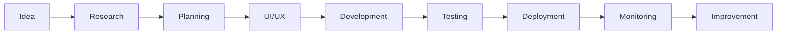

# 👋 Hi, I'm Jacob Chademwiri

### Full-Stack Web Developer • Project Manager • SaaS Builder

I build modern, scalable web applications, business automation platforms, and enterprise management systems using **Next.js**, **TypeScript**, and the modern JavaScript ecosystem.

I'm passionate about creating software that solves real business problems—from Tender Management Systems and Project Management platforms to SHEQ/IMS compliance solutions.

---

# 📊 GitHub Statistics

  

  
  

  
  

  

  

  

---

# 👨‍💻 About Me

I'm a software developer and project manager passionate about building digital solutions that improve the way businesses work.

I specialize in creating enterprise applications with a focus on:

- 📑 Tender Management Systems
- 📊 Business Management Platforms
- 🏗 Project Management Software
- 🛡 SHEQ & ISO Management Systems
- 🌐 Company Websites
- ⚙ Business Process Automation
- 📱 Responsive Web Applications

Outside development, I work in **Tender Management** and **Project Coordination**, giving me first-hand experience in solving real operational challenges with technology.

---

# 🚀 Current Focus

- 🚀 Building **PMG Tracker 360**
- 📋 Developing **TenderEdge Solutions**
- 🛡 Expanding **SHEQ OS**
- 🌍 Growing the **PMG Hub** ecosystem
- ⚡ Learning advanced software architecture and AI-assisted development

---

# 🛠 Tech Stack

## Frontend

## Backend

## Tools & Platforms

## Currently Working With

- Next.js App Router
- TypeScript
- Drizzle ORM
- PostgreSQL
- Neon Database
- Tailwind CSS
- shadcn/ui
- Radix UI
- React Email
- Server Actions
- Turborepo

---

# 🏗 Featured Projects

## 🚀 PMG Hub

Playhouse Media Group monorepo containing multiple production-ready websites and internal applications.

**Highlights**

- Multi-project workspace
- Shared UI components
- Modern architecture
- TypeScript-first

🔗 https://github.com/jchademwiri/pmg-hub

---

## 📋 PMG Tracker 360

An enterprise Tender and Project Management platform designed to streamline the entire tender lifecycle.

### Features

- Tender Register
- Document Management
- Project Tracking
- Purchase Orders
- Team Collaboration
- Progress Monitoring
- Reporting Dashboard

**Built with**

- Next.js
- TypeScript
- Drizzle ORM
- PostgreSQL

🔗 https://github.com/jchademwiri/pmg-tracker-360

---

## 🛡 SHEQ OS

An open-source operating system for implementing Health, Safety, Environment and Quality Management Systems.

### Includes

- ISO Documentation
- HIRA
- Risk Registers
- Audits
- Corrective Actions
- Training Records
- Compliance Documentation

🔗 https://github.com/jchademwiri/sheq-os

---

# 💼 What I Build

✔ SaaS Applications

✔ Business Dashboards

✔ Tender Management Systems

✔ Project Management Software

✔ Internal Business Tools

✔ Company Websites

✔ Admin Dashboards

✔ Enterprise Web Applications

---

# 📚 Currently Learning

- AI-assisted Development
- Software Architecture
- Accessibility (A11y)
- Performance Optimization
- PostgreSQL Optimization
- Edge Functions
- DevOps Best Practices

---

# 📈 Development Workflow

---

# 🌟 Open Source

I enjoy building open-source tools that help businesses improve productivity, compliance, and operational efficiency.

If my projects help you, consider giving them a ⭐.

---

# 🤝 Let's Collaborate

I'm always interested in working on projects involving:

- SaaS Platforms
- Business Automation
- Tender Management
- Project Management
- Next.js Applications
- Open Source
- Enterprise Software

---

# 📬 Connect With Me

---

### 💡 *"Technology should simplify business, not complicate it."*

**Thanks for visiting my profile!**

Feel free to explore my repositories, open an issue, or connect if you'd like to collaborate.

⭐ **Happy Coding!**

